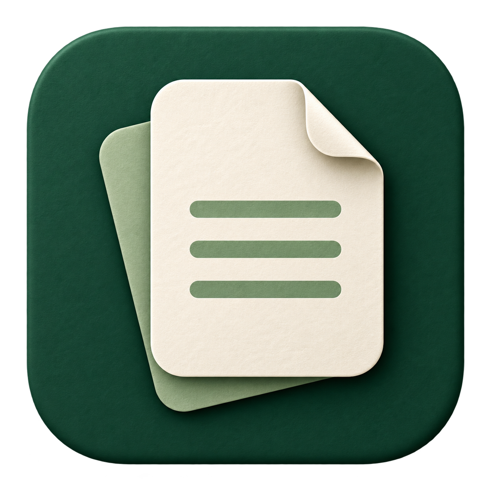

# 纸感护眼 · PaperCare



一个中文 Windows 桌面小工具：为桌面叠加轻微的纸张纹理，并提供独立的暖色和压暗调节。参考 [PaperMan](https://paperman.cc/) 的纸感覆盖方式，界面和纹理独立实现。

## 开始使用

从 [Releases](https://github.com/DCspirit-23/Paper-Care/releases) 下载 Windows x64 压缩包，解压后打开 `PaperCare.exe`。这是自包含版本，无需另外安装 .NET。第一次运行时覆盖效果默认关闭。

1. 选择细纹纸、棉麻纸、柔雾纸或夜读纸。
2. 在阅读预览中调整纹理强度、暖色和压暗。
3. 打开总开关，将效果应用到主屏幕或所有屏幕。

同时使用其他屏幕滤镜或纸张覆盖工具时，效果会叠加；比较效果时请只启用其中一种。

## 日常操作

| 操作 | 方法 |
| --- | --- |
| 开启或关闭覆盖 | 面板开关、托盘菜单或 `Ctrl+Alt+P` |
| 增强或减弱纹理 | 强度滑条或 `Ctrl+Alt+↑` / `Ctrl+Alt+↓` |
| 临时关闭 | 暂停 10 分钟，到期自动恢复，也可提前恢复 |
| 收起面板 | 关闭窗口后继续在系统托盘中运行 |
| 重新打开面板 | 托盘入口或再次打开程序 |
| 完全退出 | 面板或托盘中的退出入口，同时移除覆盖层 |

休息提醒默认关闭，可选择 20、30、45 或 60 分钟。系统的通知设置可能影响提醒显示。

## 设置与限制

设置保存在当前用户的 `%LOCALAPPDATA%\PaperCare\settings.json`，更改后自动保存。程序不会修改显示器硬件亮度或系统色彩配置，也不会添加开机启动项。

覆盖层是桌面窗口。Windows 安全桌面、独占全屏及部分受保护的视频画面可能无法覆盖。屏幕截图或录屏是否包含纹理取决于捕获方式。此工具用于调整屏幕观感，不提供医疗效果保证。

## 开发

使用 .NET 10、WPF 和 Windows 原生透明窗口，不依赖第三方 UI 框架。开发需要 Windows x64 和 .NET 10 SDK。构建命令：

```powershell
dotnet build PaperCare.csproj -c Release
```

生成自包含单文件程序并运行自检：

```powershell
powershell -NoProfile -File .\build-release.ps1
```

程序输出到 `dist`，自检结果输出到 `artifacts`。分发时须保留项目 `LICENSE`、`THIRD-PARTY-NOTICES.md` 及 `licenses` 目录。

需求边界见 [REQUIREMENTS.md](REQUIREMENTS.md)，实际验证范围见 [ACCEPTANCE.md](ACCEPTANCE.md)。

## 许可证

PaperCare 源码及原创纹理采用 [MIT License](LICENSE)，版权归属 `DCspirit-23`。自包含发行包中的 .NET 组件及其第三方依赖保留各自的许可证，详见 [第三方声明](THIRD-PARTY-NOTICES.md)。

PaperCare 是独立项目，与 PaperMan 没有关联，也不包含其代码、图标或纹理素材。
