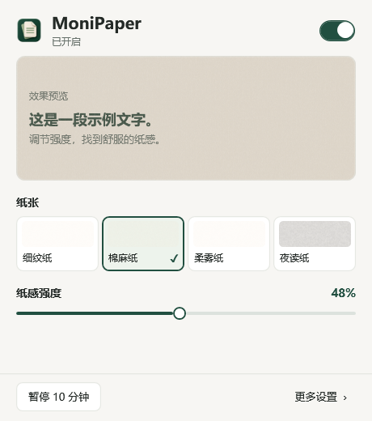
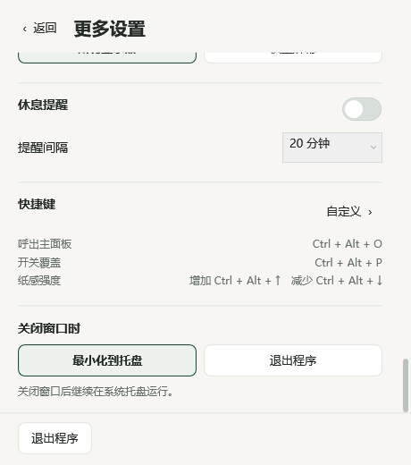
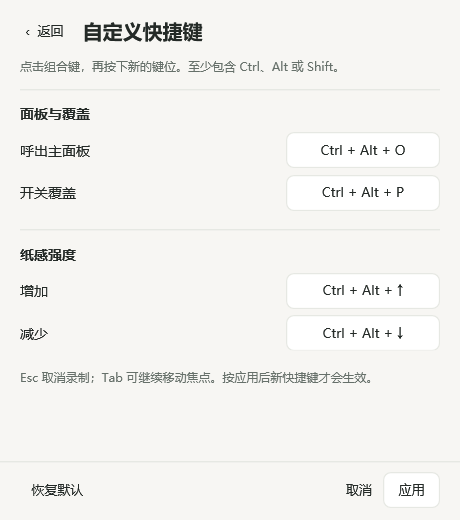

# MoniPaper


一个中文 Windows 桌面小工具，原名 PaperCare：为桌面叠加轻微的纸张纹理，并提供独立的暖色和压暗调节。参考 [PaperMan](https://paperman.cc/) 的纸感覆盖方式，界面和纹理独立实现。

## 开始使用

从 [Releases](https://github.com/DCspirit-23/MoniPaper/releases) 下载 Windows x64 压缩包，解压后打开 `MoniPaper.exe`。这是自包含版本，无需另外安装 .NET。第一次运行时覆盖效果默认关闭。升级时请先退出仍在托盘运行的旧版 PaperCare。

1. 选择细纹纸、棉麻纸、柔雾纸或夜读纸。
2. 调整“纸感强度”，在预览中查看效果。
3. 打开右上方的开关，将效果应用到桌面。

“更多设置”包含暖色、压暗、显示器选择、休息提醒、快捷键和关闭窗口的行为。返回主面板时保留当前设置。预览始终显示所选效果，是否应用到桌面以顶部状态为准。

同时使用其他屏幕滤镜或纸张覆盖工具时，效果会叠加；比较效果时请只启用其中一种。

## 界面预览

以下是使用示例参数生成的 WPF 离屏预览，不包含 Windows 标题栏。





## 日常操作

| 操作 | 方法 |
| --- | --- |
| 呼出主面板 | 默认 `Ctrl+Alt+O`，也可从托盘打开 |
| 开启或关闭覆盖 | 面板开关、托盘菜单或默认 `Ctrl+Alt+P` |
| 增强或减弱纹理 | 强度滑条或 `Ctrl+Alt+↑` / `Ctrl+Alt+↓` |
| 临时关闭 | 暂停 10 分钟，到期自动恢复；暂停期间同一按钮显示恢复操作 |
| 关闭窗口 | 按“关闭窗口时”的选择退出程序或最小化到系统托盘；默认托盘 |
| 重新打开面板 | 托盘入口或再次打开程序 |
| 完全退出 | 面板或托盘中的退出入口，同时移除覆盖层 |

休息提醒默认关闭，可选择 20、30、45 或 60 分钟。系统的通知设置可能影响提醒显示。

## 自定义快捷键

在“更多设置”的快捷键区域选择“自定义”，点击一个键位后按下新的组合键。呼出面板、开关覆盖、增强纸感、减弱纸感四个键位都可以修改；增强和减弱属于同一类强度操作。

修改后选择“应用”。软件会检查重复或无效组合，并尝试向 Windows 注册新键位；注册冲突或保存失败时保留原有配置。“恢复默认”只修改当前草稿，仍需应用才生效。返回会放弃尚未应用的修改。

录制仅在当前编辑页激活时进行；完成、取消、失焦或隐藏窗口后会结束捕获。已注册的组合键也可录入供冲突检查，长按主键不会反复录入。

关闭窗口的行为可以单独选择“退出程序”或“最小化到系统托盘”。面板和托盘中的显式“退出程序”操作始终退出应用并移除覆盖效果。

## 设置与限制

为保留旧版设置，配置继续保存在当前用户的 `%LOCALAPPDATA%\PaperCare\settings.json`。普通设置更改后自动保存，快捷键在应用成功后保存。旧配置没有新字段时，使用默认快捷键和托盘关闭行为。程序不会修改显示器硬件亮度或系统色彩配置，也不会添加开机启动项。

快捷键冲突检查以 Windows 的原生注册结果为准，不能保证识别所有第三方软件的低级键盘钩子。

覆盖层是桌面窗口。Windows 安全桌面、独占全屏及部分受保护的视频画面可能无法覆盖。屏幕截图或录屏是否包含纹理取决于捕获方式。此工具用于调整屏幕观感，不提供医疗效果保证。

## 开发

使用 .NET 10、WPF 和 Windows 原生透明窗口，不依赖第三方 UI 框架。开发需要 Windows x64 和 .NET 10 SDK。构建命令：

```powershell
dotnet build PaperCare.csproj -c Release
```

生成自包含单文件程序并运行自检：

```powershell
powershell -NoProfile -File .\build-release.ps1
```

程序输出到 `dist`，自检结果输出到 `artifacts`。分发时须保留项目 `LICENSE`、`THIRD-PARTY-NOTICES.md` 及 `licenses` 目录。

生成离屏界面预览及布局、状态检查结果：

```powershell
.\dist\MoniPaper.exe --render-ui
```

该模式不显示窗口，也不读取或修改当前用户设置。输出位于工作目录下的 `artifacts`；它不能替代真实鼠标、键盘及多屏测试。

需求边界见 [REQUIREMENTS.md](REQUIREMENTS.md)，界面规范见 [DESIGN.md](DESIGN.md)，实际验证范围见 [ACCEPTANCE.md](ACCEPTANCE.md)。

## 许可证

MoniPaper 源码及原创纹理采用 [MIT License](LICENSE)，版权归属 `DCspirit-23`。自包含发行包中的 .NET 组件及其第三方依赖保留各自的许可证，详见 [第三方声明](THIRD-PARTY-NOTICES.md)。

MoniPaper 是独立项目，与 PaperMan 没有关联，也不包含其代码、图标或纹理素材。
